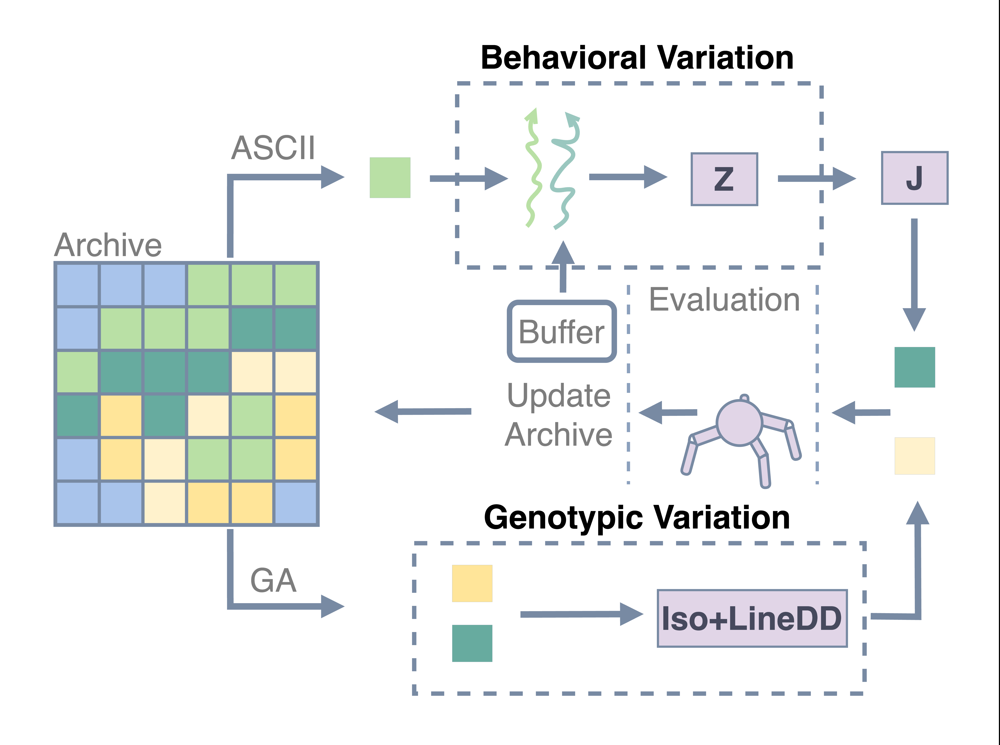

# Action Sequence Crossover with performance-Informed Interpolation MAP-Elites

This repository implements:
- **ASCII-ME**, introduced in [_Scaling Policy Gradient Quality-Diversity with Massive Parallelization via Behavioral Variations_](https://arxiv.org/abs/2501.18723), GECCO 2025

All experiments can be reproduced within a containerized environment, ensuring reproducibility!

## Overview

  
   
  <em>High-Level Illustration of the ASCII-ME algorithm</em>

The ASCII-ME method employs two distinct variation operators within the standard MAP-Elites loop: 
- **Iso+LineDD**, which mutates a parent genotype based on that
of a randomly selected elite; 
- **ASCII**, which interpolates
between the parent’s behavior and another behavior sampled
from the buffer, using performance metrics encapsulated in
𝒁. The behavioral changes are then mapped to the genotypic
space by 𝑱 to mutate the parent genotype.

**ASCII-ME** is the first Policy Gradient Quality Diversity algorithm that does not rely on Actor-Critic methods, yet capable of evolving Deep Neural Network policies with thousands of parameters at competitive sample and runtime efficiency. This, combined with its strong scalability on a single GPU, underscores the potential of this promising new framework for non Actor-Critic Policy Gradient Quality Diversity methods.

### Baselines

The repository containers the code to run the following algorithms:
- [_ASCII-ME_](https://arxiv.org/abs/2501.18723)
- [_DCRL-ME_](https://arxiv.org/abs/2401.08632)
- [_PGA-ME_](https://dl.acm.org/doi/10.1145/3449639.3459304)
- [_MEMES_](https://arxiv.org/abs/2303.06137)
- [_PPGA_](https://arxiv.org/abs/2305.13795)
- [_ME_](https://arxiv.org/abs/1504.04909)

